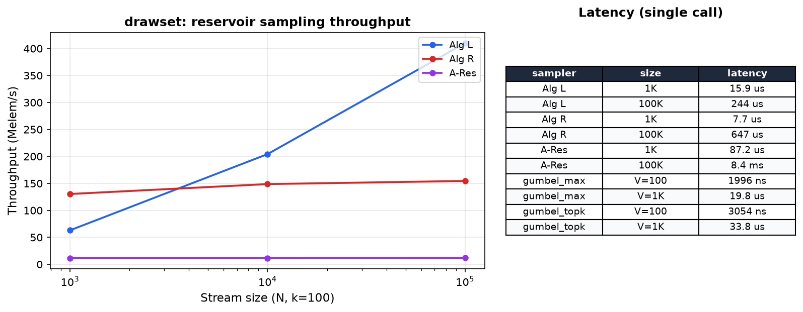

# drawset

[](https://crates.io/crates/drawset)
[](https://docs.rs/drawset)

Sampling and subset-selection primitives.

## Modules

- `reservoir`: reservoir sampling (Algorithm L/R) and weighted reservoir (A-Res).
- `gumbel`: Gumbel-max, Gumbel-top-k, Gumbel-Softmax, relaxed k-hot.
- `neighbor`: graph neighborhood sampling (with and without replacement).
- `qmc`: quasi-Monte Carlo sequences re-exported from `lowdisc`.
- `thinning`: kernel thinning and herding (greedy coreset selection via MMD).

## Quickstart

```toml
[dependencies]
drawset = "0.1.1"
```

```rust
use drawset::reservoir::ReservoirSampler;

let mut sampler = ReservoirSampler::new(5);
for i in 0..100 {
    sampler.add(i);
}
let samples = sampler.samples();
assert_eq!(samples.len(), 5);
```

## Operations

| Function / Type | Description |
|----------------|-------------|
| `gumbel_max_sample` | Categorical sample via Gumbel-max trick |
| `gumbel_topk_sample` | Top-k without replacement via Gumbel perturbation |
| `gumbel_softmax` | Differentiable categorical approximation |
| `relaxed_topk_gumbel` | Relaxed k-hot via iterated Gumbel-Softmax |
| `ReservoirSampler` | Algorithm L (Li, 1994): O(k(1 + log(N/k))) |
| `ReservoirSamplerR` | Algorithm R (Vitter, 1985): O(N) baseline |
| `WeightedReservoirSampler` | A-Res (Efraimidis & Spirakis, 2006) |
| `NeighborSampler` | Graph neighborhood sampling (with/without replacement) |
| `halton_sequence` / `sobol_sequence` / `sobol_scrambled` / `SobolGenerator` | Quasi-Monte Carlo sequences from `lowdisc` |
| `kernel_thin` / `kernel_herd` / `mmd_sq_from_gram` | Kernel thinning and herding: greedy MMD coreset selection (Dwivedi & Mackey, 2021) |

## Examples

- `cargo run --example distribution_demo`: ASCII histograms showing uniform vs weighted sampling distributions.
- `cargo run --example weighted_topk`: compare Gumbel-top-k (Plackett-Luce) vs weighted reservoir
  (A-Res) on the same weight vector.
- `cargo run --example gumbel_softmax_demo`: Gumbel-Softmax (Jang et al. 2017) for differentiable subset selection, the trick that lets discrete sampling sit inside a gradient-trained model.
- `cargo run --example streaming_reservoir`: stream 1M items through a reservoir of size 100 and verify uniformity.

## Tests

```bash
cargo test -p drawset
```

## Performance



*Apple Silicon (NEON). Run `cargo bench` to reproduce on your hardware.*

## References (what these implementations are trying to be faithful to)

- Vitter (1985): reservoir sampling "Algorithm R".
- Li (1994): reservoir sampling "Algorithm L" (skip-based; reduces RNG calls).
- Efraimidis & Spirakis (2006): weighted reservoir sampling (A-Res / A-ExpJ family).
- Gumbel-max trick: classical extreme value sampling identity (often cited via ML papers):
  - Jang, Gu, Poole (2017): *Categorical Reparameterization with Gumbel-Softmax*.
  - Maddison, Mnih, Teh (2017): *The Concrete Distribution*.

## License

MIT OR Apache-2.0
